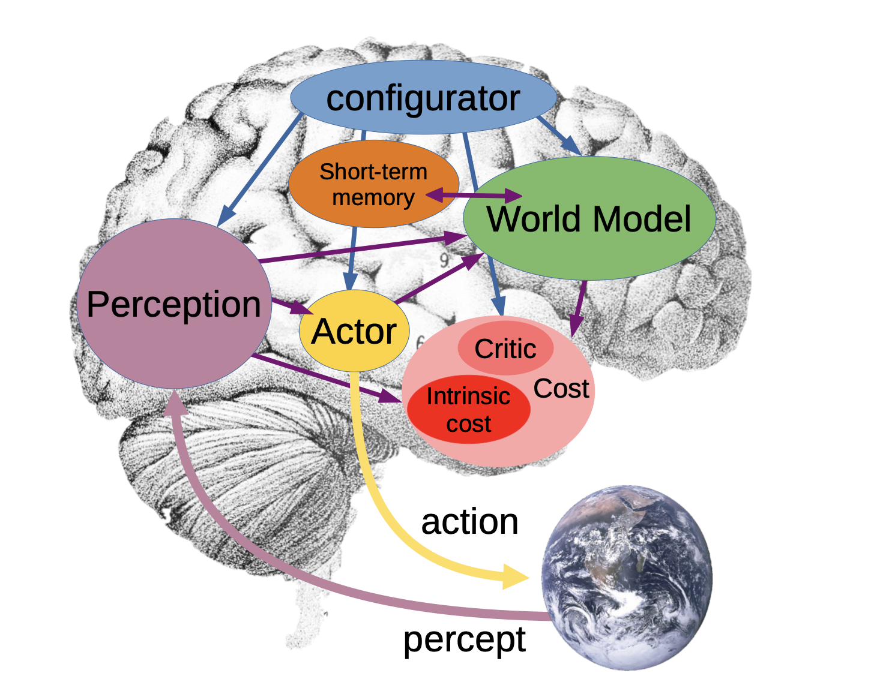
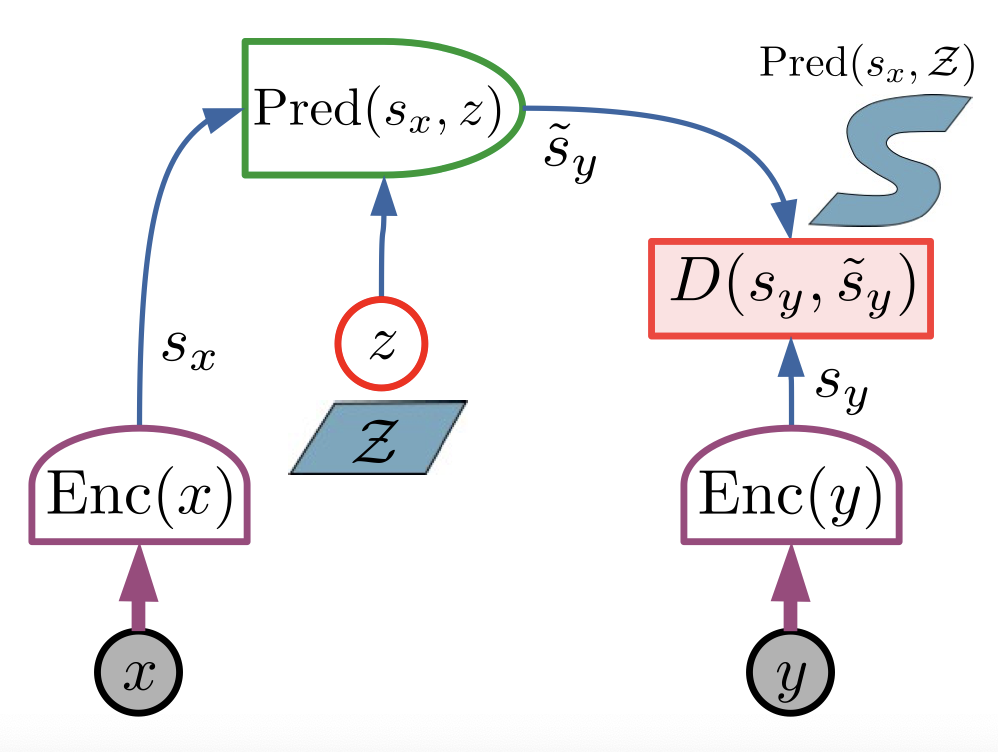
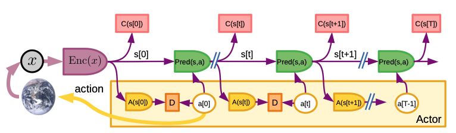
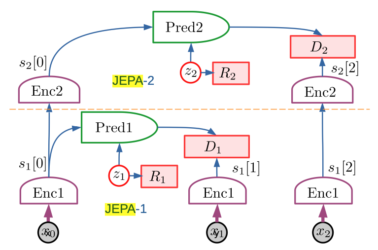

# A Path Towards Autonomous Machine Intelligence

**Yann LeCun**

## Overview

[Video Recording](https://youtu.be/iKaHHheVROY)

### Problem

1. How to represent the world primarily using observational data? 
    - interaction with real world is dangerous and expensive
2. How to plan actions in ways compatible with gradient-based learning?
3. How to represent action plans in a hierarchical manner?
    - multiple levels of abstraction and multiple time scales

### Approach

- A cognitive architecture with many interworking differentiable modules
- Learn more efficiently and safely like humans by learning a model of the world
    - Joint Embedding Prediction Architecture (JEPA) can be used for learning a world model
- Plan hierarchically using the world model
    - Traditional model-predictive-control planning approach using Hierarchical-JEPA for hierarchical predictions

## Architecture Overview

- **World Model-** predicts next state of world given the current state and an action taken
    - Can be configured to focus on predicting different parts of the world most relevant to the task at hand
    - Predictions at multiple levels of abstraction and multiple timescales
    - How to represent uncertainty in predictions?
- **Actor-** does the planning to find the optimal action to take to accomplish the current task
    - Multiple levels of planning and different levels of abstract actions
    - Planning under uncertainty is important since the world has inherent randomness
    - This is where classical AI search techniques can be integrated
- **Perception-** process outputs from different sensors (e.g. cameras, microphones, etc.) into useful representations for the other modules
    - DL currently excels at this part
- **Configurator-** updates the settings of the other modules to accomplish the current task
- **Cost-** drives the behavior of the agent by having high-cost for undesired behaviors and low-cost for desired behaviors. an energy minimization framework (e.g. gradient descent) can then be used for planning 
    - **Intrinsic Cost**- hardwired behavioral drives like hunger, pain, etc.
    - **Critic**- neural network that is trained to predict the intrinsic cost for a state
- **Short-term memory-** stores states from the world. used to train world model and critic 

### Question 1

- What is the advantage of most of the modules being differentiable?

## Joint Embedding Predictive Architecture (JEPA)

- Non-generative: cannot be used to predict $y$ from $x$
- Caputres the dependencies between $x$ and $y$ without explicitly generating predictions of $y$
- Predict the representation of $y$ from the representation of $x$
    - Make predictions in representation space, so it does not need to predict every detail of y

### Question 2

- Why is prediction in the representation space instead of original pixel space important for JEPA's success?

### Hierarchical JEPA (H-JEPA)

## Critical Analysis

- Does not reference many important prior related works
    - cognitive architectures have been researched before but he cites none of them
    - leaves out many other important works regarding learning for machine intelligence
- Does not develop ideas for how the configurator module might work, which is one of the more important modules for the whole architecture to work as described so more detail here would have been useful
- Seems focused on planning for physical actions, less clear if this architecture would be useful for NLP tasks that LLMs currently excel at 
- This is just LeCunn's personal position on how to achieve autonomous machine intelligence but others have different approaches that might work as well

## Resources

### Papers

- [Model-based Reinforcement Learning: A Survey](https://www.nowpublishers.com/article/Details/MAL-086)

- [Mastering Diverse Domains through World Models](https://arxiv.org/pdf/2301.04104.pdf)
    - Many of Danjir Hafner's papers are on the topic of world models and planning with them
- [Transformers are Sample Efficient World Models](https://arxiv.org/abs/2209.00588)

- [Building Machines that Learn and Think Like People](https://arxiv.org/abs/1604.00289)

### Videos

- [Yannic Kilcher Paper Explanation](https://www.youtube.com/watch?v=jSdHmImyUjk&t=1s)
- [Yann LeCun Paper Technical Talk](https://www.youtube.com/watch?v=DokLw1tILlw)
